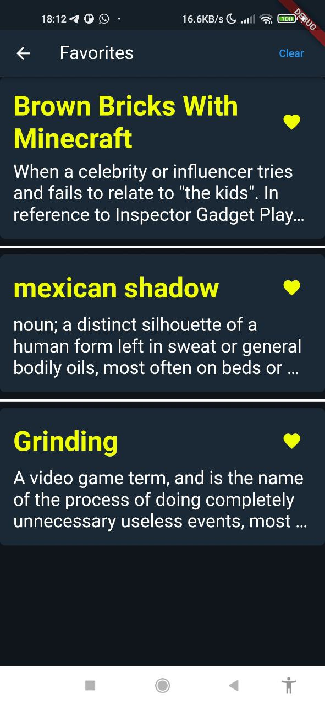

# Flutter_UDWrapper
## A wrapper application for Urban Dictionary
The Urban Dictionary Wrapper Application is a user-friendly interface designed to simplify and enhance interactions with the Urban Dictionary API. This application serves as a bridge between users and the vast repository of contemporary slang and informal expressions found on Urban Dictionary, offering a seamless and intuitive experience.
 

 
## Features:
- Search for terms and phrases
   
  
- View details about certain term
   
  
- Links to other terms while viewing details
   
  
- Saving favorite phrases for quick access
   
  

- Random word for curious minds
- Light and dark themes for night owls and early-risers
   
  

Uses RapidApi and Urban Dictionary official API
Material design

Supports Android 9.0+

